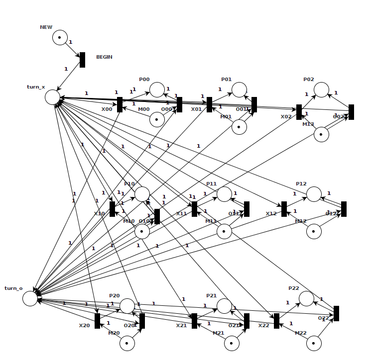

How to Code: CompleX Data
===============

Design more CompleX programs, using new data structures, abstraction, and generative recursion.

  
 

About this course
-------------

As your program requirements get more complex, you will find that simple additions to the design method make it easy to write well-structured and well-tested code that is easy to maintain.

By learning how to capture common data and control structures using abstraction, your programs will get shorter and better tested.

### **Project**

### **My Track**

