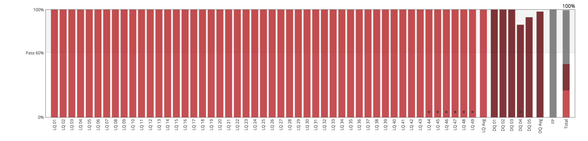
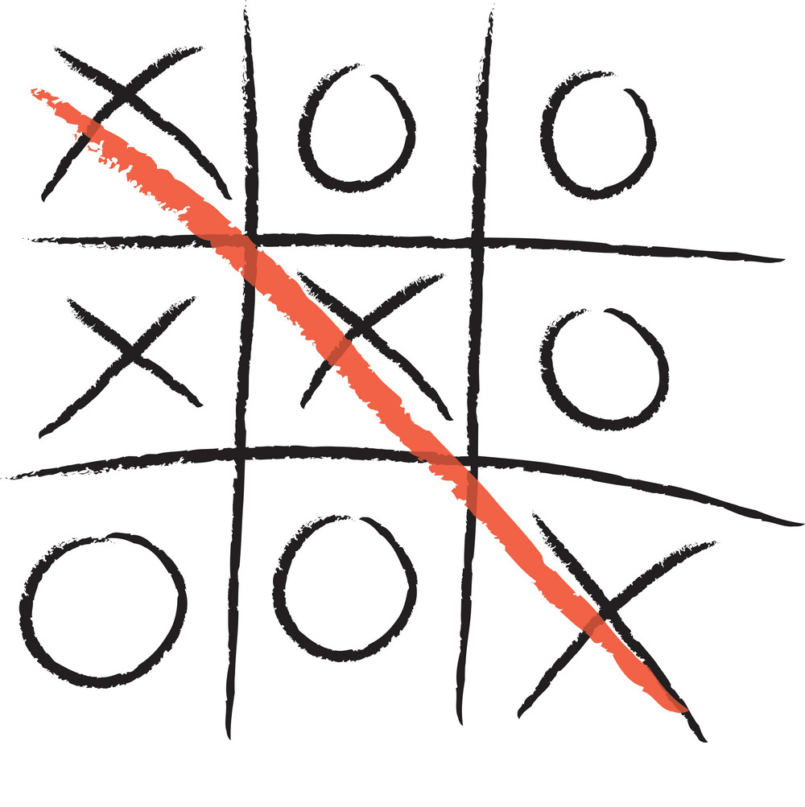
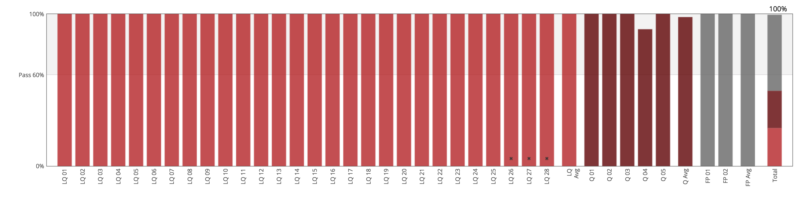
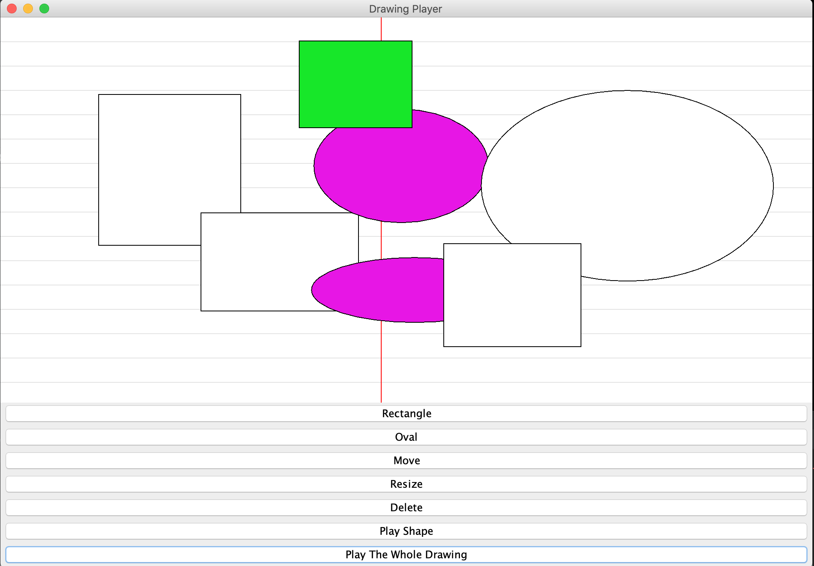
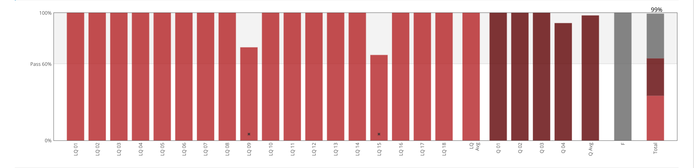
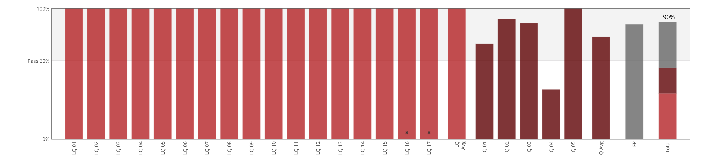

# Software Development
UCBx

<!--  -->

  
 

> The "How to Code" courses are based on [How to Design Programs](http://www.htdp.org/), which itself is an attempt at rethinking the pedagogical approach of The Structure and Interpretation of Computer Programs.

## [1. How To Code: Simple Data](./HowToCode_SimpleData)

### **_Project_**: _Space Invaders_

Click Image to watch the Demo

  
 

### **_My Track_**

------

## [2. How To Code: CompleX Data](./HowToCode_CompleXData)

### **_Project_**: Tic Tac Toe

  
 

### **_My Track_**

------

## [3. Software Construction: Data Abstraction](./SoftwareConstruction_DataAbstraction)

### **_Project_**: Simple Drawer Player

  
 

### **_My Track_**

------

## [4. Software Construction: Object Oriented Design](./SoftwareConstruction_ObjectOrientedDesign)

### **_Project_**: Simple Drawer Player

  
 

### **_My Track_**

