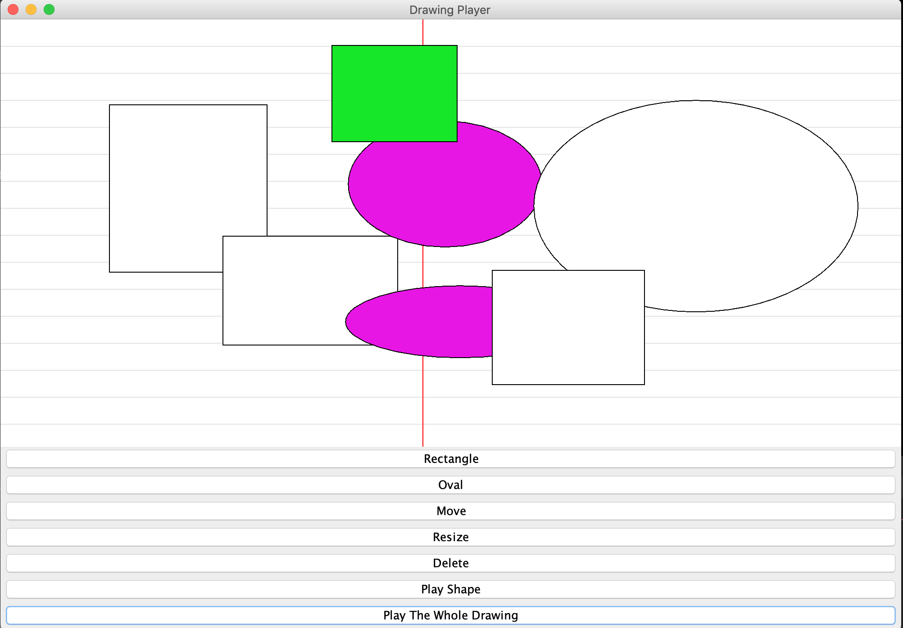

# Software Construction: Data Abstraction

we're going to be looking at dealing with larger programs in an imperative style, and you're going to be going through this journey of thinking in an object oriented way, so doing object oriented thinking, design, and programming.

  
 

## About this course

Software Construction: Data Abstraction dives into:

- Control and Data Flow: Structures & Models.
- Data Abstraction: Specifying and Using, Testing and Implementing.
- Types, Dispatch and Polymorphism

### **Project**

> [Click the image to watch the video](https://youtu.be/N43Wwvk3wlg).

> [Click here to download the App](https://github.com/doct0rX/SoftwareDevelopment/releases/tag/v1).

### **My Track**

