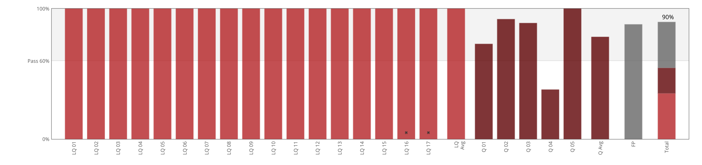

# Software Construction: Object Oriented Design

we're going to be looking at dealing with larger programs in an imperative style, and you're going to be going through this journey of thinking in an object oriented way, so doing object oriented thinking, design, and programming.

  
 

## About this course

Software Construction: Object Oriented Design dives into:

- How to read and use software design patterns
- To implement and test an object-oriented design
- How to develop an application using online services and APIs

> [Syllabus](./screens/screencapture-courses-edx-org-courses-course-v1-UBCx-SoftConst2x-3T2017-courseware-b5438c537e7f4d2586449a4fb667c734-d89e7a686fc14c00ad0cdb27560457bb-2018-10-16-02_50_24.png)

### **Project** [Source](https://github.com/doct0rX/SoftwareDevelopment/releases/tag/v2)

### **My Track**

