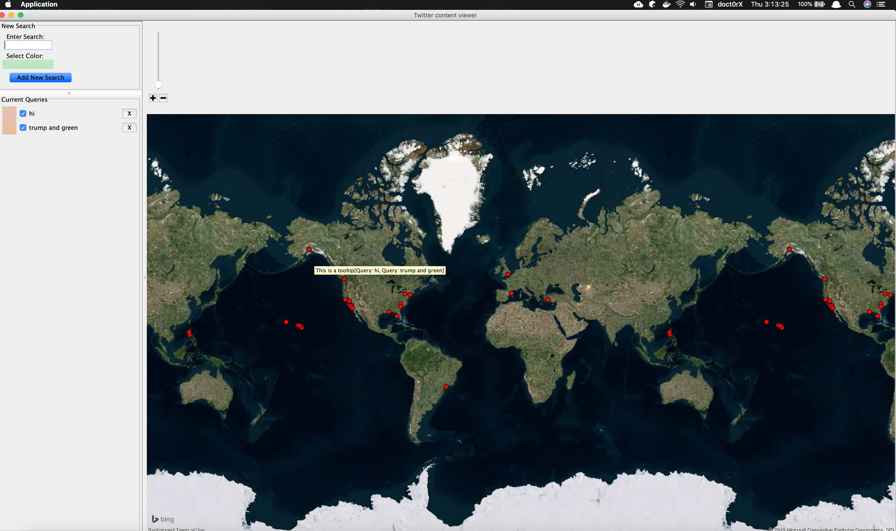

# Final Project: Twitter Mapper

## Description

For the project you will complete a graphical Java application called The Twitter Mapper. This application allows the user to specify keywords of interest, and monitors tweets from a service that samples Twitter in real time (or replays tweets that were previously recorded). It also plots the location of the user the originated the tweet on a map of the world. To do this, the app makes use of an existing geographical mapping library and the Twitter API.x

There are two primary portions of the project that you will complete. First is the portion that connects to the Twitter service to receive tweets, and selects those tweets that match any of the patterns that are specified by the user of the application. The second portion of the project is to display a marker corresponding to the location in the world of the originator of each matching tweet, including defining tool-tips that show the text of each tweet when the user hovers over the map marker with the mouse.

### Screens

Final Project Screen:

Current Project Screen:

